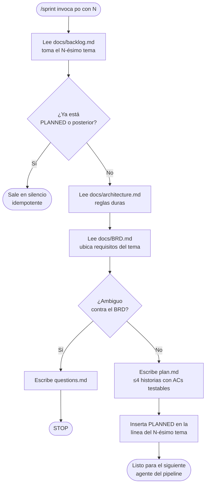

# PO Agent — cómo funciona

El agente `po` (Product Owner) es el primer eslabón de un pipeline de sprint. Su único trabajo es planear un sprint: toma un tema del backlog, lo aterriza en historias de usuario con criterios de aceptación verificables, y deja marcado ese tema como planeado. No escribe código ni diseño; solo produce el plan que los agentes siguientes van a ejecutar.

## Qué recibe y qué produce

Lo invoca un orquestador `/sprint` que le pasa un número de sprint `N`. Con ese número, el agente lee tres documentos como fuente de verdad: `docs/backlog.md` (de donde escoge el **N-ésimo** tema), `docs/BRD.md` (donde ubica los requisitos que corresponden a ese tema), y `docs/architecture.md` (las reglas duras que las historias no pueden violar: solo memoria, usuarios hardcodeados, localhost, lista mínima de dependencias).

De ahí produce dos salidas. La primera es `docs/sprints/sprint-{N}/plan.md`, un archivo nuevo con hasta 4 historias, cada una con su rol, su acción, su valor, sus referencias al BRD, sus criterios de aceptación testables y sus dependencias. La segunda es una mutación quirúrgica de `docs/backlog.md`: inserta la insignia `[PLANNED]` al inicio de la línea del N-ésimo tema, justo después del número, sin tocar los demás temas ni renumerar nada.

## Las tres reglas que lo hacen seguro

Hay tres comportamientos que vale la pena entender porque protegen el pipeline de correr dos veces o de inventar cosas.

Es **idempotente**: si el N-ésimo tema ya trae `[PLANNED]` o un estado posterior (`[DESIGNED]`, `[IN PROGRESS]`, `[DONE]`), el agente sale en silencio sin hacer nada. Podés re-invocarlo sin miedo a duplicar historias.

**Respeta la arquitectura**: antes de escribir historias lee `architecture.md`, así que ninguna AC te va a pedir una base de datos o una dependencia fuera de la lista permitida.

**Se detiene ante la ambigüedad**: si el tema no está claro contra el BRD, en vez de adivinar escribe la pregunta en `docs/sprints/sprint-{N}/questions.md` y para. No produce un plan a medias.

## Flujo

