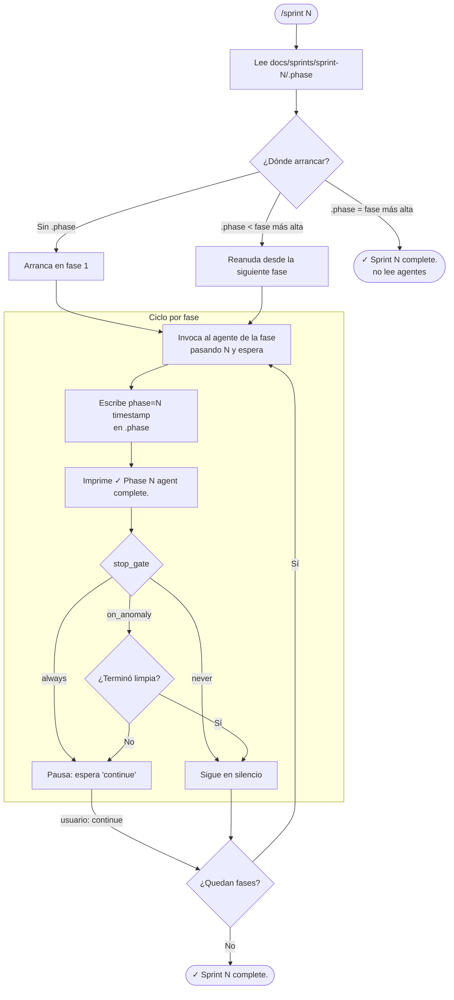

# Sprint Orchestrator — cómo funciona

El skill `/sprint` es el director de orquesta del pipeline. No hace el trabajo de un sprint él mismo: coordina a los agentes que sí lo hacen, los corre en orden, anota el progreso en disco y aplica las reglas de gobernanza que deciden cuándo pausar y cuándo seguir. Lo invocás con un número, por ejemplo `/sprint 1`, y ese número es la `N` que atraviesa todo el flujo.

## El modelo mental: fases, agentes y gates

La configuración vive dentro del propio skill, en el bloque `phases:`. Hoy trae una sola fase:

    phases:
      1: { agent: po, stop_gate: always }

Cada fase amarra tres cosas: un número de orden, el agente que la ejecuta (fase 1 → el agente `po`), y un `stop_gate` que decide qué pasa cuando esa fase termina. El orquestador corre las fases en orden ascendente (1 → 2 → 3 → …). A medida que agregués agentes al pipeline (diseño, desarrollo, QA), cada uno entra como una fila nueva en este bloque y el orquestador los va encadenando sin que cambie su lógica.

## Los tres stop gates

El `stop_gate` es la palanca de gobernanza. Después de que una fase termina, el orquestador consulta su gate para decidir si te devuelve el control o sigue solo.

Con `always` pausa siempre: imprime `Phase N (<agent>) complete. Continue?` y espera a que vos digás `continue`. Es el control humano explícito, y es el que usa la fase 1 hoy. Con `on_anomaly` es más autónomo: si la fase terminó limpia (sin errores y sin que el agente haya escrito nada en `questions.md`) sigue de largo; si detecta un problema, pausa para que revisés. Con `never` continúa en silencio, sin interrumpirte.

## El breadcrumb `.phase`: reanudar y saber cuándo terminó

El orquestador guarda una miga de pan en `docs/sprints/sprint-N/.phase`, una sola línea con la última fase completada y su timestamp:

    phase=<N> <timestamp ISO 8601>

Ese archivo es lo que le permite reanudar sin repetir trabajo. Cuando lo invocás, primero lee `.phase` y decide dónde arrancar: si no existe, empieza en la fase 1; si marca una fase por debajo de la más alta configurada, reanuda desde la siguiente; y si ya está en la fase más alta, entiende que el sprint terminó, imprime `✓ Sprint N complete.` y para sin leer ningún archivo de agente. Por eso podés cortar un sprint a mitad de camino y relanzarlo: retoma exactamente donde quedó.

## El ciclo de cada fase

Para cada fase que toca correr, el orquestador repite el mismo ciclo de cuatro pasos: invoca al agente de esa fase como subagente pasándole la `N` y espera a que termine, escribe `phase=<N> <timestamp>` en `.phase`, imprime `✓ Phase <N> (<agent>) complete.`, y aplica el `stop_gate` configurado. Cuando ya corrieron todas las fases, cierra con `✓ Sprint N complete.`

## Flujo

